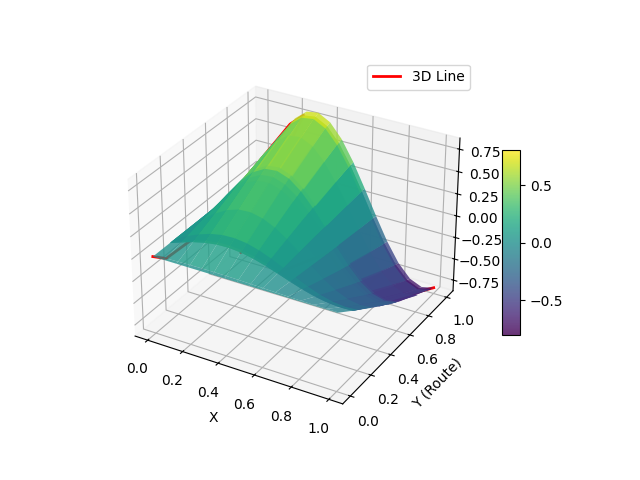
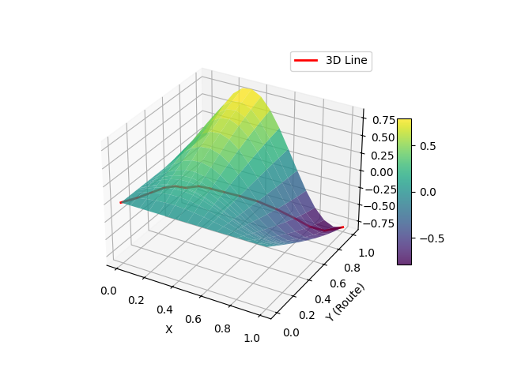
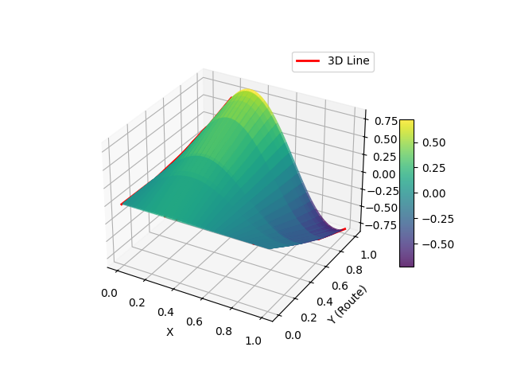
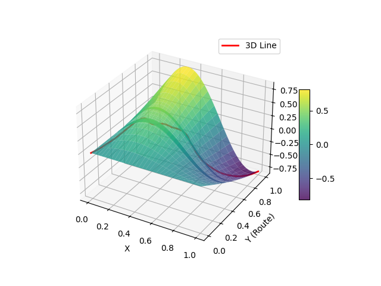
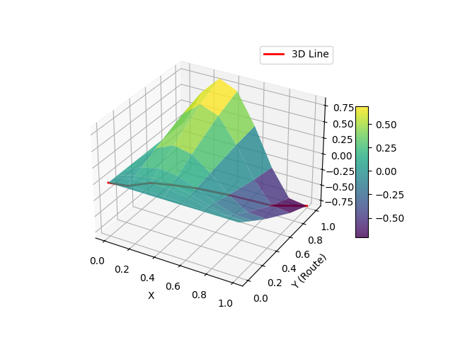

| Route  | Local Points | Approx Points | Iterations | Cost   | Optimized Cost | Approximation Image                     | Local Variations Image                  |
|--------|--------------|---------------|------------|--------|----------------|-----------------------------------------|-----------------------------------------|
| Broom  | 8            | 4             | 8          | 1.162  | 1.158          |  |  |
| Broom  | 32           | 16            | 16         | 1.151  | 1.129          |  |  |
| x^2    | 8            | -             | 4          | 1.171  | 1.141          |      |      |
| x^2    | 32           | -             | 16         | 1.167  | 1.134          |      |      |
| Random | 16           | -             | 10         | 4.545  | 1.213          |  |  |
| Random | 64           | -             | 100        | 60.891 | 1.488          |  |  |